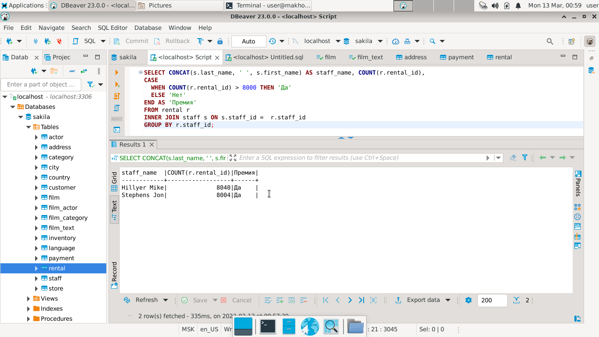

# Домашнее задание к занятию 12.4. «SQL. Часть 2» - `Елена Махота`

- [Ответ к Заданию 1](#1)
- [Ответ к Заданию 2](#2)
- [Ответ к Заданию 3](#3)
- [Ответ к Заданию 4*](#4)
- [Ответ к Заданию 5*](#5)

---

Задание можно выполнить как в любом IDE, так и в командной строке.

### Задание 1

Одним запросом получите информацию о магазине, в котором обслуживается более 300 покупателей, и выведите в результат следующую информацию: 
- фамилия и имя сотрудника из этого магазина;
- город нахождения магазина;
- количество пользователей, закреплённых в этом магазине.

### *<a name ="1">Ответ к Заданию 1</a>*

Вариант 1

```sql
SELECT  CONCAT(s.last_name, ' ', s.first_name) AS staff_name, ca.city, cc.count_customer 
FROM staff s
INNER JOIN 
  (SELECT a.address,  c.city, a.city_id, a.address_id  
   FROM address a
   JOIN city c ON c.city_id = a.city_id) ca
ON ca.address_id = s.address_id 
INNER JOIN store ON store.store_id = s.store_id
INNER JOIN 
  (SELECT COUNT(store_id) count_customer, store_id 
   FROM customer 
   GROUP BY store_id) cc
ON cc.store_id = s.store_id
WHERE cc.count_customer > 300; 
```


Вариант 2

```sql
SELECT  CONCAT(s.last_name, ' ', s.first_name) AS staff_name, c.city, COUNT(customer.customer_id)
FROM staff s
INNER JOIN address a ON  a.address_id = s.address_id 
INNER JOIN city c  ON  a.city_id  = c.city_id  
INNER JOIN store ON store.store_id = s.store_id
INNER JOIN customer  ON store.store_id = customer.store_id
GROUP BY staff_id 
HAVING  COUNT(customer.customer_id) > 300; 
```


---

### Задание 2

Получите количество фильмов, продолжительность которых больше средней продолжительности всех фильмов.

### *<a name ="2">Ответ к Заданию 2</a>*

```sql
SELECT COUNT(f.title)   
FROM film f
WHERE  f.length > 
 (SELECT AVG(length) as avg_length
  FROM film); 
```


---

### Задание 3

Получите информацию, за какой месяц была получена наибольшая сумма платежей, и добавьте информацию по количеству аренд за этот месяц.

### *<a name ="3">Ответ к Заданию 3</a>*


```sql
SELECT MONTHNAME(payment_date) as 'месяц с наибольшей суммой платежей', SUM(amount), COUNT(rental_id)
FROM payment  
GROUP BY MONTHNAME(payment_date)
ORDER BY SUM(amount) DESC
limit 1;
```


---
## Дополнительные задания (со звёздочкой*)
Эти задания дополнительные, то есть не обязательные к выполнению, и никак не повлияют на получение вами зачёта по этому домашнему заданию. Вы можете их выполнить, если хотите глубже шире разобраться в материале.


### Задание 4*

Посчитайте количество продаж, выполненных каждым продавцом. Добавьте вычисляемую колонку «Премия». Если количество продаж превышает 8000, то значение в колонке будет «Да», иначе должно быть значение «Нет».

### *<a name ="4">Ответ к Заданию 4*</a>*

```sql
SELECT CONCAT(s.last_name, ' ', s.first_name) AS staff_name, COUNT(r.rental_id),
CASE
  WHEN COUNT(r.rental_id) > 8000 THEN 'Да'
  ELSE 'Нет'
END AS 'Премия'
FROM rental r 
INNER JOIN staff s ON s.staff_id =  r.staff_id  
GROUP BY r.staff_id;
```



---

### Задание 5*

Найдите фильмы, которые ни разу не брали в аренду.

### *<a name ="5">Ответ к Заданию 5*</a>*

```sql
SELECT f.title 
FROM film f
LEFT JOIN inventory i ON i.film_id = f.film_id
LEFT JOIN rental r ON r.inventory_id = i.inventory_id
WHERE r.rental_id IS NULL AND i.inventory_id IS NULL;
```

